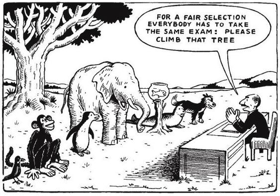

```{r setup, include=FALSE}
knitr::opts_chunk$set(echo = TRUE)
knitr::opts_chunk$set(warning = FALSE)
knitr::opts_chunk$set(message = FALSE)
```

# Analiza Czynnikowa
## Wprowadzenie

Własności świata szczególnie interesujące dla badaczy nie zawsze są możliwe do zmierzenia. Nazywa się je **zmiennymi latentnymi/ukrytymi** Problem ten dotyczy szczególnie nauk społecznych, jak socjologia czy psychologia. 

Zwykle naukowcy starają się znaleźć jakąś **mierzalną cechę** (lub kombinację takich cech), która będzie dobrze oddawać faktyczną własność. Problem w tym, że można znaleźć bardzo dużo różnych takich cech.

$$\ x_{1} = lambda_{11}f_{1} + lambda_{12}f_{2} + ... + lambda_{1k}f_{k} + u_{1}$$
$$\ x_{2} = lambda_{21}f_{1} + lambda_{22}f_{2} + ... + lambda_{2k}f_{k} + u_{2}$$
$$\ ...$$
$$\ x_{n} = lambda_{n1}f_{1} + lambda_{n2}f_{2} + ... + lambda_{nk}f_{k} + u_{n}$$

## Przykład

*Nie da się zmierzyć poziomu zakochania pary ludzi. Ale można:*

- *zadać im o to pytania w ankiecie,*
- *badać poziomy niektórych hormonów,*
- *przeprowadzić analizę sentymentalną wiadomości, które do siebie piszą,*
- *...*


## Podstawowe błędy

- Badacz wybiera mierzalną cechę, która bardzo luźno dotyczy zmiennej latentnej: *ocena z religii jako miara wiary w Boga*
- Badacz utożsamia cechę mierzalną z latentną: *IQ nie jest miarą inteligencji, tylko miarą zdolności rozwiązywania specyficznych zadań*
- Badacz nie weryfikuje, czy cecha mierzalna w taki sam sposób łączy się z latentną we wszystkich badanych grupach: 


## Exploratory Factor Analysis

**Eksploracyjna Analiza Czynnikowa** jest badaniem, w którym próbuje się odkryć zależności między grupami zmiennych mierzalnych, które wskazują na istnienie wpływających na nie zmiennych ukrytych.

W tym celu stosuje się zwykle **analizę korelacji**.

# Przykład (demokracja)

## Zmienne [1]

Mam wyniki kilku pytań ankietowych dotyczących poglądów na demokrację. Ankieta została przeprowadzona w paru krajach europejskich.

**Skala: 1 - Nie jest istotną cechą demokracji, 10 - jest istotną cechą demokracji**

- *taxRich* - Rząd opodatkowuje bogatych i oddaje ubogim
- *religiousLaw* - Autorytety religijne interpretują prawo
- *freeElection* - Liderzy są wybierani w wolnych wyborach
- *helpUnemp* - Bezrobotni otrzymują pomoc od państwa

## Zmienne [2]

- *armyTakesOver* - Armia przejmuje władzę jeśli rząd jest niekompetentny
- *civilRights* - Prawa obywatelskie chronią człowieka przed opresją państwa
- *equalIncome* - Państwo dba o równość dochodów
- *obeyRulers* - Ludzie są posłuszni rządzącym
- *genderEquality* - Kobiety mają takie same prawa jak mężczyźni

- *importance*: 1 - Demokracja nie jest istotna, 10 - Demokracja jest absolutnie istotna

## Przegląd danych [1] {.smaller}

Na potrzeby prezentacji dane są już po selekcji, filtrowaniu, usuwaniu braków itd.

```{r echo=FALSE}
library(knitr)
dem_data <- read.csv("processed_data.csv")

kable(head(dem_data))
```


## Przegląd danych [2] - różnice międzykrajowe

```{r echo=F}
library(ggplot2)

ggplot(dem_data) +
  geom_bar(aes(taxRich)) +
  facet_wrap(~country, ncol = 7) +
  ggtitle("Wyższe opodatkowanie bogatych jako istotna cecha demokracji")
```

## Przegląd danych [3] - styl odpowiedzi

```{r echo=F}
library(dplyr)
library(tidyr)

dem_data %>% 
  gather(key = "variable", value = "answer", -country, factor_key = T) %>%
  dplyr::group_by(country, variable, answer) %>% 
  filter(country == "Romania") %>%
ggplot() +
  geom_bar(aes(answer)) +
  facet_wrap(~variable, ncol = 10, scales = "free_x") +
  ggtitle("Rozkład odpowiedzi dla Rumunii")
```


## Analiza korelacji [1] {.smaller}

```{r}
library(corrplot)
cor.matrix <- cor(dem_data[,2:11], method="spearman")
corrplot(cor.matrix, method="circle", order='hclust')
```

## Analiza korelacji [2] {.smaller}

Są tu trzy główne skupiska:

- *fundamentalistyczne*: istotność autorytetów religijnych, posłuszeństwo wobec władzy i armia,
                        która może przejąć władzę, gdy rząd jest niekompetentny
- *ekonomiczne*: państwo demokratyczne powinno opodatkować bogatych, a wspierać biednych,
                 w demokracji powinny być w miarę równomierne zarobki
- *liberalne*: demokracja jest ważna, wiąże się z prawami człowieka, równością płci, wolnymi wyborami

Dodatkowo: państwo wspierające bezrobotnych pasuje zarówno do "libearlnej" jak i "ekonomiecznej"
            "liberalna" najbardziej "kłóci się" z "fundamentalistyczną"

## Model

```{r}
library(lavaan)

model <- '
fundamentalistic =~ obeyRulers + religiousLaw + armyTakesOver;
economic =~ taxRich + equalIncome + helpUnemp;
liberal =~ freeElection + genderEquality + civilRights + importance'

fit <- cfa(model, data = dem_data)
```

## Wyniki estymacji {.smaller}

```{r}
kable(parameterEstimates(fit)[,c(1:4, 7)], digits = 3, caption = "Wyniki estymacji")
```


# Równoważność pomiarowa

## Poziomy równoważności {.smaller}

```{r eval = F}
configural <- cfa(model, data=dem_data, group="country")

weak <- cfa(model, data=dem_data, group="country", group.equal="loadings")

strong <- cfa(model, data=dem_data, group="country", 
              group.equal=c("loadings", "intercepts"))

strict <- cfa(model, data=dem_data, group="country", 
              group.equal=c("loadings", "intercepts", "residuals"))
```

```{r echo=F, warning=F}
configural <- cfa(model, data=dem_data, group="country")
weak <- cfa(model, data=dem_data, group="country", group.equal="loadings")
```

```{r}
anova(configural, weak)
```
## Brak równoważności [1] {.smaller}

```{r echo=F}
params <- parameterEstimates(configural)
params <- params %>% select(lhs, op, rhs, group, est, pvalue) %>% filter (op == "=~")

param_names <- params[1:10, 1:3]
compare_params <- data.frame(param_names, Estonia = params[1:10, 5], Germany = params[11:20, 5],
                  Poland = params[21:30, 5], Romania = params[31:40, 5], Slovenia = params[41:50, 5])

kable(compare_params[1:3,], digits=3, caption="Porównanie grup")
```

## Brak równoważności [2]

image: 
