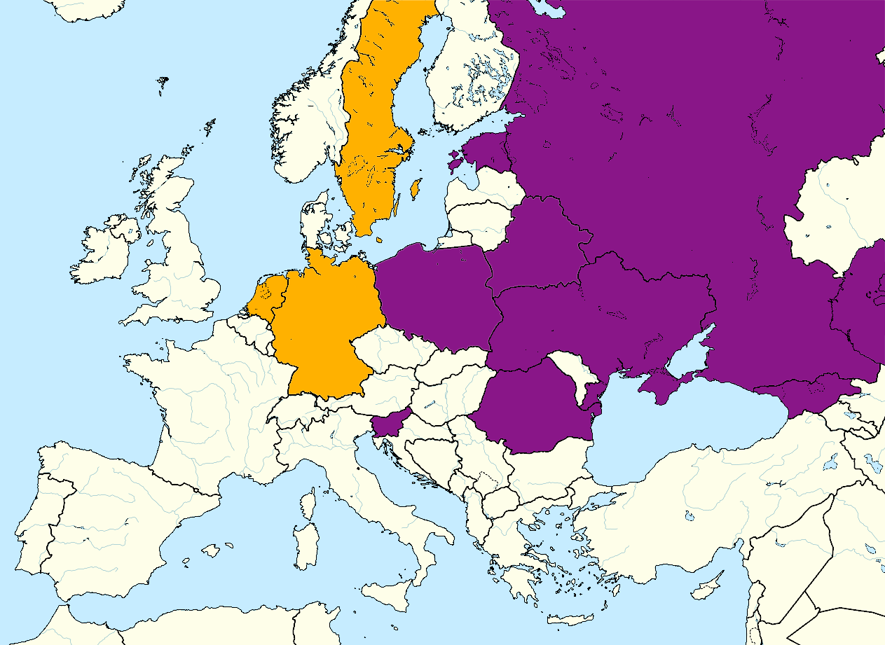

```{r setup, include=FALSE}
knitr::opts_chunk$set(echo = F, warning = F, message = F)
library(tikzDevice)
knitr::opts_knit$set(eval.after = "fig.cap", dev = 'tikz')
library(knitr)
library(kableExtra)
library(ggplot2)
library(dplyr)
library(tidyr)
library(captioner)
library(corrplot)
library(cluster)
library(semTools)
library(semPlot)
library(lavaan)
library(ggsci)
library(ggpubr)
library(ggdendro)
library(scales)

table_nums <- captioner(prefix = "Table")
fig_nums <- captioner(prefix = "Figure")

```

```{r, echo=FALSE}
pdf.options(encoding='CP1250')
```

# Introduction {.unnumbered}

The word "democracy" is frequently used in politic declarations, shouted out on demonstrations, spoken in media as well as in privat conversations. Commonly, the subject goes beyond what is considered as "democracy" in political sciences, i.e. *"Democracy means only that the people have the opportunity of accepting or refusing the men who are to rule them"* [@Schumpeter]. A discrepancy between a formal definition and its common understanding shouldn't be surprising, however I would argue it's a serious issue in this context. The Earth won't stop orbiting the Sun, even if all human populace belive otherwise, but the shape of democratic systems actually depends on how their citizens conceptualise democracy. And their concepts may not be "correct", and may not be universal.

The problem can be especially pressing in international comparative reaserches. If we measure the state of democracy or social attitude toward it, based on one arbitrary concept of democracy, we may miss the real reasons behind people's choices. This paper is intended to explore Europeans' belives on the essentials of democracy, based on data gathered by World Values Survey. It will reveal the social concepts of democracy, measure their popularity, and check their comparability across the Europe.

This paper is organised as follows. The first chapter summarise the most common ways of defining and measuring democracy, based on theoretical concepts as well as on social surveys. The second one presents the factor analysis model, which will be used in empirical research, and the issue of measurement invariance, which is a condition of a proper multi-group factor analysis. The following chapters describe the empirical research and some conclusions drawn from it.  


\newpage

# The quantitative measures of democracy


## Why do we need to measure democracy?

The need of a quantitative measure of the state of democracy came into existance in the second half of 20th century in the USA. It was belived, that democratic countries are less likely to engage in wars, especially against other democracies. For people responsible for US' intarnational policies, leveling up democracy in the key regions seemed necessery to establish a world peace [@Doorenspleet]. Some kind of index was needed to compare countries' states of democracy, and judging how far they are from an ideal democracy, or whether democratisation efforts actually worked out.

Beside that, expressing democracy with a number opens wide possibilities to use statistical model in research of democracy, both as an exo- and endogenous variable. It allowed to examine couses, effects, and properties of democracy in more reliable, methodologically correct and reproducible way. Partly in account to that, the straight-forward connection between a state of democracy and peace has been undermined by scholars [@Doorenspleet]. Still, democracy continues to be a subject of intense researches, which suffer from several difficulties. 

First of all, international studies need to deal with problematic cultural and linguistic differences, that make objectivity challenging and generalisations risky. The second problem is the definition itself, as it is chosen arbitrarily, and not always clearly stated. Finally, reaserches show that the concept of democracy is highly susceptible to emotions [@JaskoKoss]. People are used to thinking of democracy not as one of possible forms of political system, but rather as its ideal state. That's why so many countries with democracy in their name are commonly considered authoritarian. It leads to cramming into concept of democracy all the ideas, that one perceives as good for the commonwealth, whether they are a part of political system or not. 

Based on minimalistic definition, democracy in its core is a mechanism of forcing policies without using violence. The will of majority needs to be accepted, not because majority is necessarily right, but because those opposing it have always major power against them - despite that nowadays power is more connected to technical advancement than the number [@Przeworski]. As Przeworski further notices, durability and quality of democracy depends on several factors, both political and economic. When people act for or against democracy, they may do so because they're convinced they can gain from it - not bacause they believe in specific formal system. That's why it's worth to try to define democracy based on people's expectations, not on the mechanism of changing the rulers.


## Indices of democracy

The majority of democracy indices is based on expert's assessments. Countries are granted points for meeting specified standards. This means, that each case is compared to a concept of ideal democracy, chosen by experts. There exists some indices based on minimalistic concept with binary scale (is democratic or not), however they are mostly used to analyse the duration of democratic regimes [@Coppedge], as they put democracies at very different states to the same box.

One of the most popular indices is is annually computed by an american organisation Freedom House [@Doorenspleet]. Freedom House Index (FH) uses a 7-grade scale to rate the state of political and civil rights (the lower the better). Despite it wasn't even designed as a measure of democracy, it is widely used as such [@Coppedge], because it reflects the prevailing concept of liberal democracy.

However useful, democracy indices faced a lot of criticism. It was argued, that they rely too much on the formal procedures and the state of law, and not how it is actually implemented; and that too loose criteria allow experts to project they opinion of country's democracy on the score [@Coppedge]. Especially FH Index met with an accusation of conservative and pro-market bias, which led to underrating leftist or muslim governments [@Doorenspleet].


## Social concept of democracy

On the other side, we can study democracy as it is viewed by citizens themselves. It is not an alternative way to the same goal (as it won't provide a one-size-fits-all definition, that would allow world-wide comparations), but rather an attempt to examine a concept of democracy shared by people, who have established or are supporting it.

It was showed by @Campbell, that at the base of common support for democracy lies the process of modernisation, which touched all aspects of human life and made changes "everyone's interest". As the main reasons for this support he lists: a)$~$involvement in social organisations, which *"provides an antidote to apathy and alienation and projects a climate of trust onto the polity"*, b)$~$economic factors - prosperity boosts support, which dissolve in harder times, c)$~$behavioral factors, which cause that people in general support a winning, most popular option.

The survey conducted by @JaskoKoss showed also, that democracy is identified with some set of moral and civil values (the standard of freedom), or with *"providing safty and well-being for all, and solving problems of the poor"*^[Translated by author.] (the standard of welfere). 

Support for democracy is not sourced mainly from its political properties, but partly because people are used to it, and partly because of the civil and economic safety they expect it can provide.


\newpage

# Multi-group factor analysis


## A factor analysis model

Social scientists frequently deal with non-measurable phenomenon. Their existence can be suspected by observing the way they impact the others, measurable properties. The same applies to a social concept of democracy, which may not be directly defined or even concious, but it reveal itself in people's choices and opinions. The method of statistical modeling in such cases was first proposed by Spearman [@Everitt], and it will be briefly summarised in this chapter.

The general factor analysis model can be described by the set of equations (\ref{eq:latent-model}). Factors (or latent constructs) $\lambda$ impact measurable variables (indicators) $X$ with factor loadings $\alpha$.


\begin{align} 
\label{eq:latent-model}
\begin{split}
x_1 &= \alpha_{01} + \alpha_{11} \lambda_1 + ... + \alpha_{k1} \lambda_k + \epsilon_1\\
& \vdotswithin{=} \\
x_p &= \alpha_{0p} + \alpha_{1p} \lambda_1 + ... + \alpha_{kp} \lambda_k + \epsilon_p\\
\end{split}
\end{align}

Each element $x$ and $\epsilon$ is an n-element vector. We assume, that indicators are conditionally independent. It means, that the relation between any two $x$ comes solely from the fact, that they are impacted by one or more shared latent factors. This can be described by the equation:

\begin{equation}
\label{eq:shared-var}
\sigma_{ij} = \sum_{r=1}^k \alpha_{ir} \alpha_{jr} \text{, gdzie } i \neq j
\end{equation}

where $\sigma_ij$ is an element of the cross-covariance matrix of $X$. If we denote as $\psi_i$ a variance of error ($\epsilon$) of i-th variable, a variance of each $x$ can be described as:

\begin{equation}
\label{eq:spec-var}
\sigma_{ii} = \sum_{j=1}^k \alpha_{ij}^2 + \psi_i
\end{equation}

where the first segment denote volatility shared by $x_i$ with other variables through common latent factors, and the second segment is its specific variance. Because all latent variables are unknown, estimation is based on cross-covariance matrix. The key is to find such values of parameters, that would match with variances and covariances. Incorrectly specified model may not be identified, or may have wrong properties, e.g. negative estimated variances. 

Model is identified, if there can be found only one set of parameters' values. If this condition is not met, the parameters can't be interpreted [@ESSEduNet]. The problem is, a model with latent factors can never be strictly identified.

A cross-covariance matrix with elements described previously in equations (\ref{eq:shared-var}) and (\ref{eq:spec-var}), can be expressed in matrix format:

\begin{equation}
\label{eq:var-matrix}
\Sigma = A A' + \Psi
\end{equation}

where $A$ is a $k$x$n$ matrix of latent factors, and $\Psi$ is a diagonal matrix of specific variances. It can be noted, that for orthogonal $n$x$n$ matrix $T$ (i.e. such that multiplied by its transposition gives an identity matrix):

\begin{equation}
\label{eq:scaling}
A T (A T)' + \Psi = A T T' A' + \Psi = A A' + \Psi = \Sigma
\end{equation}

This means, that the factor loadings can't be identified, and matrix $A$ can be identified only up to multiplying by any othogonal matrix [@Shapiro]. Thus, factor loadings cannot be directly interpreted, like parameters in regression model. Moreover, they can be freely scaled to set the variance of latent factor on a desired level, typically 1.

Accounting to that, a factor analysis model is said to be identified when all possible sets of parameters come from scaling a matrix of loadings. Only if after choosing a scale model isn't fully identified, it needs to be modified [@ESSEduNet].


## Estimation of a factor analysis model

Having measures $X$ we can compute the cross-covariance matrix $S$,  and mimalise difference between $S$ and $\Sigma$ to find the values of parameters. Commonly used Maximum Likelihood method assumes multivariete normal distribution of observations, although the problems arising from breaking this condition can be overcome by using robust standard errors and scaling test statistics [@Rosseel, @SatorraBentler]. ML method minimalises the function opposite to log-likelihood, given by the equation:

\begin{equation}
\label{eq:loglikelihood}
l(S, \Sigma) = ln|\Sigma| - ln|S| + trace(S \Sigma^{-1}) - p
\end{equation}

We can then compute the Goodness of Fit Index (GFI):

\begin{equation}
\label{eq:gfi}
GFI = \frac{l(S, \Sigma)}{n-1} \text{   } \sim \chi^2 (\frac{(p-k)^2 - (p+k)}{2})
\end{equation}

GFI allows to test the null hypothesis, that a cross-covariance matrix assumed by model is identical with the observed one. However, this statistic is dependent on $n$, and for big samples it may be too sensitive for small inaccuracies, to be used in real-life cases [@CheungRens]. There are many others indicators of goodnes of fit. It is verified that the CFI (Comparative Fit Index) and the TLI (Tucker-Lewis Index) should be equal or bigger than 0.95, whereas the RMSEA (Root Mean Square Error of Approximation) shouldn't exceed 0.06 [@HuBentler]. 


## Measurement invariance 

Comparative researches are one of the main advantages of factor analysis. As it was explained before, factor loadings don't have an interpretation, however they become meaningful in comparison between groups, e.g. of different age, gender, culture, or in other time points [@Pokropek]. The biggest difficulty is that researcher needs to make sure - especially when dealing with highly diverse groups - that the relationship between latent and measurable variables is identical across all groups. That property is called a measurement invariance [@ChenEtAl].

In a factor analysis model, the latent factor is estimated based on relationship between measurable variables. Lack of measurment invariance means, that in some groups exist other, unnoticed relationship, and its impact will be interpreted as an impact of other latent factor [@HirBra]. To describe this situation, let's assume that the real notion of phenomenon in the group **A** is a set of equations (\ref{eq:delta-model}), and in group **B** - a set of equations (\ref{eq:latent-model}). If the researcher overlook the problem, and estimate the model (\ref{eq:latent-model}) in all cases, the impact of latent factor $\delta$ in the group **A** will be assigned to $\lambda$, which can be of entirely different nature.


\begin{align}
\label{eq:delta-model}
\begin{split}
x_1 &= \alpha_{01} + \alpha_{11} \lambda_1 + ... + \alpha_{k1} \lambda_k + \beta_1 \delta + \epsilon_1 \\
& \vdotswithin{=} \\
x_p &= \alpha_{0p} + \alpha_{1p} \lambda_1 + ... + \alpha_{kp} \lambda_k + \beta_p \delta + \epsilon_p \\
\end{split}
\end{align}

Incompatible relationships between measurable variables may have variety of causes. In the international studies it can be lack of direct translation, cultural differences, historical context, etc. For egzample, the english word "neighborhood" means the closest space, whereas in german it is relater to social closeness - which caused some problems in translating the Bogardus social distance scale [@Pokropek]. @ArDav found the problem with measurment invariance in the study of attidute toward democracy.

On the other hand, the groups' differences, discoverd through test of measurement invariance, shouldn't be treated merely as a caveat (unless they don't result from researcher's mistake, e.g. a bad translation). They can give a great insight into how different groups view and conceptualise reality [@CheungRens].

Measurement invariance is usually tested on three levels: configural, metric and scalar [@ArDav]. The first one is fulfilled, if the same model is identified and fits the data in all groups.  If the concept is well-known and there are no deep differences, configural invariancs shouldn't be challenging [@LubGlog]. In international studies it can be broken due to translation errors, or when concepts are based on specific cultural context and have different meaning in different groups [@CheungRens]. Problems with the first level of invariance don't allow to apply the model to multi-group comparison.

Metric invariance means, that the factor loadings in each groups have the same levels. In other words, the impact's size of latent factor on measurable variables is identical. Otherwise, we couldn't say whether observed differences in indicators' levels in groups are caused by actual differences in factors' levels, or by differences in the way factors affect the observations. To test the measurement invariance, we need to perform two models in each group: one with freely estimated factor loadings, and the second one with restriction, that respective loadings have to be the same in every group. If unrestricted model comes out significantly better (tested with Likelihood Ratio Test), the condition of metric invariance is broken.

Metric invariance allows a multi-group comparison, where latent factors are used as exogenous variables. Since the relationships between latent and measurable variables are statistically equal across groups, the change of latent variable would cause the same change of measurable variables in every group. It doesn't allow, however, to use the factor as an endogenous variable, as different groups can have different constants (parameter $\alpha_{01}$ in equation \ref{eq:latent-model}).

It leads as to scalar invariance, where model's structure and all parameters are equal across groups. The process of testing is the same as for metric invariance, with restrinctions imposed on both factor loadings and constants. There are possible other types of invariance (e.g. of errors of approximation), although they don't present any additional advantages to comparative researches. 


\newpage

# A factor analysis of concepts of democracy 


## Data


World Values Survey is an international organisation, focused on political, social, economic, religious and cultural values around the world [@WVSData]. Their survey, conducted once in every few years in almost 100 countries, covers the topic of democracy as well.

The respondents were asked 10 questions, each ranged on 10-point scale. In the first 9 questions respondents were asked to asses, to what extent a given property of the state is an essential characteristic of democracy (1 - not essential, 10 - definitely essential):

1. Governments tax the rich and subsidize the poor;
2. Religious authorities ultimately interpret the laws;
3. People choose their leaders in free elections;
4. People receive state aid for unemployment;
5. The army takes over when government is incompetent;
6. Civil rights protect people from state oppression;
7. The state makes people’s incomes equal;
8. People obey their rulers;
9. Women have the same rights as men.

In the last questions a responded needed to determine, how important it is to live in democratic country (1 - not at all important, 10 - absolutly important). 

Variables containing answers for all above questions will be noted as X1 - X10. I used data from 6th Wave (2010-2014) from all geographicly european countries covered in survey. There are: **Belarus, Estonia, Georgia, Germany, Kazakhstan, Netherland, Poland, Romania, Russia, Slovenia, Spain, Sweden, Turkey, and Ukraine**

```{r load-data}
dem_data <- read.table("dem_data.csv")
questions <- c("Taxes for rich, aid for poor",
               "Influence of religious authorities",
               "Free elections",
               "Help for unemployed",
               "Army can take over",
               "Civil rights",
               "Income equality",
               "Obeying rulers",
               "Gender equality",
               "Importance of democracy")
names(questions) <- c("taxRich", "religiousLaw", "freeElection", "helpUnemp", 
                      "armyTakesOver", "civilRights", "equalIncome", "obeyRulers",
                      "genderEquality", "importance")
```

```{r descr-plot, fig.align = 'left', fig.width = 7, fig.height = 8, fig.cap = "Rozkład odpowiedzi na pytania o demokrację w ankiecie WVS. Źródło: opracowanie własne."}

dem_data %>% 
  gather(key = "variable", value = "answer", -country, factor_key = T) %>%
  ggplot(aes(answer)) + geom_histogram(bins = 10, col = "black") +
  facet_wrap(~variable, nrow = 5, scales = "free", 
    labeller = labeller(variable = questions)) + theme_light() +
  theme(text = element_text(family = "serif")) +
  scale_x_continuous("Odpowiedź", breaks = 1:10) +
  scale_y_continuous("Liczba odpowiedzi")
```

`r fig_nums(name = "descr-plot", display = "cite")` presents the histograms of answers in the whole sample. This basic plot already suggest, that minimalistic Schumpeter's concept of democracy is not enough for european society. Citizens commonly believe, that democracy means not only "free elections", but also civil rights, gender equality, and - what is probably more surprising - help for unemployed. In voters opinion, a possibility to choose the rulers is not enough to have a democratic country. These rulers need to satisfy the basic needs of freedom, equality, and economic safty of the ruled. 

One can also notice a common believe, that a democratic system doesn't need an intervention form army or religious leaders. Respondents were less unanimous in the question of redistribution or income inequality. Majority consider it as essential for democracy, although the dominance of the highest answer is not that striking.


## Analysis of correlation

When a respondent answer the question "how essential [something] is as a characteristic of democracy?", they need to invoke some concept of democracy and check, if the property lies withing it. If there exist widely acknowledged concept of democracy, covering part of the questions, we can expect answers to these questions to be highly correlated. Respondents will answer in the similar way, because they share the same concept of democracy. Consequently, if there is no common social concept (i.e. how people understand democracy is highly individual), we can expect no significant relationship between answers. I will measure the relationship as Spearman's correlation coefficient, as the scale is long enaugh to be treated as numeric variable [@Revelle].

A concept of democracy can be expressed as a latent factor, which impacts answers (measurable variables). There can exist several concept, but not more than questions. The answer for a given question can be affected by more than one concept. It's worth mentioning, that the concepts can be specified only up to the topics covered by questions. It's impossible to say, whether a concept include some other opinions, e.g. on bioethics. Theoretically, there can exist as well some other concepts, based on ideas not coverd in questionare, therefore they can't be revealed in this research.


`r fig_nums(name = "cor-matrix", display = "cite")` presents a correlation matric of answers. It was tested with Bartlett's test of sphericity, which confirmed the significance of relationships between variables ($\chi^2$ = 46805,62; $df$ = 45; $p$ < 0,001).


```{r cor-matrix, fig.align = 'left', fig.cap = "Macierz korelacji odpowiedzi na pytania o demokrację. Źródło: opracowanie własne."}

cor.matrix <- cor(dem_data[,2:11], method="spearman")

quest.short <- c("X1: Taxing the rich",
                  "X2: Religious authorities",
                  "X3: Free elections",
                  "X4: Help for unemployed",
                  "X5: Army takes over",
                  "X6: Civil rights",
                  "X7: Income equality",
                  "X8: Obeying rulers",
                  "X9: Gender equality",
                  "X10: Importance of democracy")

colnames(cor.matrix) <- c("X1", "X2", "X3", "X4", "X5", "X6", "X7", "X8", "X9", "X10")
rownames(cor.matrix) <- quest.short

par(family = 'serif')
corrplot(cor.matrix, method="circle", order='hclust', tl.col = "black", tl.cex = 0.7)
```


On `r fig_nums("cor-matrix", display = "cite")` we can clearly see three clusters, which suggest the existence of three separate concepts of democracy:
 
- Concept I: variables denoting the obedience to rulers, an influence of religious authorities, a possibility of rules of army, and (to some extent) income equality;
- Concept II: income equality, higher taxes for rich, help for unemployed;
- Concept III: help for unemployed, gender equality, free elections and civil rights;

The first conception is characterised mostly by a belief, that a democracy in its core needs an ingerention of aome kind of third party: army and religious authhorities. It values obedience of citizens. It seems that this conception is built around the need of order and creal relations of power, although it also contains opinion about income inequality. This conception is negatively correlated with the third one, and more importantly - with the importance of living in democratic country at the beggining. Supposedly, people with this conception in minds actually don't value democracy, but having beed asked for its essential, project the properties of their ideal (not democratic) system on it, anyway.

The second concept view democracy as a warranter of economic benefits and safty. Its supporters expect from their government to fight income inequality, tax rich, help poor and unemployed. It shows simmilarities to the concept of welfare-state.

In the last conception, democracy is a system characterised by free election, social freedom and equality, but also supporting unemployed. Despite it goes well beyond definition proposed by Schumpeter (where free election would suffice), from these three it is the closest to definitions known in political sciences. Supporters of this conception view democracy as a warranter of social and political rights, and they show a strong need to live in democratic state.

Interestingly, that variables describing opinions on income inequality and higher taxes for rich, are positively correlated with almost any other variable.

It's good to compare `r fig_nums("cor-matrix", display = "cite")` with information drawn from `r fig_nums("descr-plot", display = "cite")`. An analysis of correlation allows merely to reason about the shape and cohesion of conceptions, and not about their popularity (how many people actually support them) and their place on the scale of answers. `r fig_nums("descr-plot", display = "cite")` suggest, that Concept III is the most popular, and its supporters were chosing the highest scores for opinions connected to it. On the other hand, supporters of Concept I were probably choosing rather low scores for questions about army or religious authorities - although relatively high, compared to rest of the population. It is also possible, that the relationships forming this conception, function more like an "anti-conception", i.e. a common notion, how democracy *shouldn't* look like.


Koncepcja II i III wydają się pokrywać z badaniami Jaśko i Kossowskiej \citeyearpar{JaskoKoss} dla polskiego społeczeństwa. Wyodrębniły one, odpowiednio: “standard opiekuńczości” oraz “standard wolności”. Z kolei analizy przyczyn poparcia i zaufania ludzi do demokracji i demokratycznych rządów pokazują, że po części wynikają one z zaangażowania obywateli w działalność społeczną, częściowo ze sprzyjającej sytuacji ekonomicznej, a częściowo z psychologicznego mechanizmu, że ludzie generalnie popierają system, który już jest przyjęty, o ile nie mają silnych powodów do niezadowolenia z niego [@Campbell]. Poparcie dla demokracji wynikające z korzystnej sytuacji ekonomicznej jasno potwierdza, że obywatele oczekują od demokratycznego systemu, że pozwoli im żyć w ogólnie pojętym dobrobycie (koncepcja II). Po drugie, skoro ludzie ufają demokratycznym rządom dzięki możliwości zaangażowania w działalność społeczną, to można przypuszczać, że oczekują od demokracji zapewnienia swobody takiego działania. Pośrednio tę swobodę można wiązać z postulatami praw obywatelskich oraz równości płci (w kontekście emancypacji kobiet, która pozwoliła im na bardziej czynny udział w życiu społecznym), znajdującymi się w koncepcji III. Trzeci, behawioralny składnik poparcia demokracji wg. Campbella, nie jest kwestią koncepcji demokracji, więc nie ma tu zastosowania.


Można również spojrzeć na społeczne koncepcje demokracji pod kątem jej trwałości. W szczególnie burzliwych momentach dziejowych wśród badaczy popularny staje się pogląd, że świat odwraca się od demokracji, choć dane jak dotąd temu przeczą [@Doorenspleet]. Padają wówczas pytania, co może sprawić, że naród odrzuci formę ustroju, uważaną przecież tak powszechnie za najlepszą z możliwych. Okazuje się, że nawet gdy obywatele nie są zadowoleni ze swoich rządzących, nie są skłonni przekreślić demokratycznego systemu ich wybierania, o ile ten system zapewnia im podstawowe prawa i zaspokaja oczekiwania. Z kolei niestabilna sytuacja ekonomiczna jest poważną próbą wytrzymałości dla młodych demokracji, jak to było widoczne pod koniec XX w. w Europie Środkowo-Wschodniej [@Klingemann]. 


To, że obywatele są gotowi odrzucić system, który nie zaspokaja oczekiwań, może brzmieć jak truizm, ale odsłania ważną niedoskonałość elitystycznej definicji Schumpetera: ludzie nie postrzegają demokracji jako systemu, który pozwala im wybrać rządzących wedle upodobania, ale jako takiego, który daje największe możliwości realizowania swoich potrzeb, zarówno społecznych jak i ekonomicznych. Wybór rządzących jest tylko środkiem do osiągnięcia celu, nie celem samym w sobie.


Pewną zagadką pozostaje kwestia koncepcji I, która wydaje się nie mieć żadnego poparcia w dotychczasowych badaniach. Na podstawie samej macierzy korelacji można by przypuszczać, że istnieje wyłącznie jako anty-koncepcja, jednak temu przeczy dalsza analiza, która pokazuje, że istnieje nieduża grupa ludzi bardziej przekonanych do tej koncepcji, niż do pozostałych.


## Model strukturalny


```{r model-all}
model <- '
fundamentalistic =~ obeyRulers + religiousLaw + armyTakesOver + equalIncome;
economic =~ taxRich + equalIncome + helpUnemp;
liberal =~ freeElection + genderEquality + civilRights + importance + helpUnemp'


fit <- cfa(model, data = dem_data, estimator = "MLR")
```

Postać modelu przedstawiono na diagramie na `r fig_nums(name = "diagram-all", display = "cite")`, zgodnie ze standardem przedstawiania równań strukturalnych [@Everitt]. Zmienne latentne zostały oznaczone przez okręgi, zmienne mierzalne przez kwadraty, a na liniach prostych między nimi podano wartości wyestymowanych ładunków czynnikowych. Zakrzywione linie oznaczają wariancje lub kowariancje. 


Ze względu na złamanie założenia o normalności zmiennych mierzalnych, model estymowano Odporną Metodą Największej Wiarygodności. Ponieważ modele ze zmiennymi latentnymi nie są ściśle identyfikowalne, o czym pisano w rozdziale 2.2, przy estymacji przyjęto jednostkową wariancję zmiennych latentnych oraz wartość pierwszego ładunku czynnikowego na 1. Na diagramie na `r fig_nums("diagram-all", display = "cite")` jest on wyróżniony przerywaną linią, ale wartości ładunków czynnikowych zostały zestandaryzowane dla wygodniejszej interpretacji. Wszystkie współczynniki są istotne. 


```{r diagram-all, fig.align = 'center', fig.cap = "Diagram modelu analizy czynnikowej koncepcji demokracji. Źródło: opracowanie własne."}
par(family = 'serif')

quest.min <- c(obeyRulers = "X8", religiousLaw = "X2", armyTakesOver = "X5", 
               equalIncome = "X7", taxRich = "X1", helpUnemp = "X4", freeElection = "X3", 
               genderEquality = "X9", civilRights = "X6", importance = "X10", "I", "II", "III")

par(family = 'serif')
semPaths(object = fit,
         whatLabels = "std",           
         edge.label.cex = 1, nCharNodes = 0,         
         layout = "circle2",  sizeMan = 7, sizeMan2 = 7, shapeMan = "square",
         sizeLat = 7, sizeLat2 = 7, shapeLat = "circle",
         sizeInt = 5, sizeInt2 = 5,    
         what = "std", edge.color = "black",
         nodeLabels = quest.min, optimizeLatRes = T)
```


I koncepcja najsilniej przejawia się w zmiennych oznaczających wpływ autorytetów religijnych na prawo oraz możliwość przejęcia władzy przez wojsko. II jest wyrażana przede wszystkim w poparciu opodatkowania bogatych i wsparcia ubogich. Koncepcja III wyraża się głównie przez docenienie wagi wolnych wyborów, a na drugim miejscu: równość płci i prawa obywatelskie. Koncepcje II i III są ze sobą pozytywnie skorelowane na średnim poziomie (0,5). Koncepcja I jest słabo, ale dodatnio skorelowana z II, oraz równie słabo, ale ujemnie, z koncepcją III.


Model posiada dość dobre własności. CFI = 0,953, jest więc na dobrym poziomie, ale TLI wynosi tylko 0,930. RMSEA wynosi 0,057; CI90% (0,055; 0,060), co również jest bardzo korzystną wartością. Łączna rzetelność konstruktu (Composite Reliability) wynosi 0,74, co oznacza, że pytania są dobrze dobrane do badanych koncepcji.


Dla każdej obserwacji w zbiorze można teraz obliczyć liczbową wartość każdej koncepcji jako średnią ważoną, gdzie wagami są standaryzowane ładunki czynnikowe. Taki wskaźnik można interpretować jako miarę tego, jak bardzo ankietowany zgadza się z daną koncepcją. `r fig_nums(name = "stats-all", display = "cite")` przedstawia, jak kształtują się te wskaźniki w całej grupie.


```{r stats-all, fig.align = 'center', fig.width = 7, fig.height = 8, fig.cap = "Rozkład wartości wskaźników koncepcji demokracji (na górze) i liczby osób, u których dana koncepcja była dominująca (na dole). Źródło: opracowanie własne."}
coeff <- standardizedSolution(fit)

# wagi
fnd_all_w <- coeff$est.std[1:4]
lib_all_w <- coeff$est.std[8:12]
econ_all_w <- coeff$est.std[5:7]

all_stats <- dem_data %>% mutate(I = (obeyRulers*fnd_all_w[1]+religiousLaw*fnd_all_w[2]+ 
                    armyTakesOver*fnd_all_w[3]+equalIncome*fnd_all_w[4])/sum(fnd_all_w),
                    II = (taxRich*econ_all_w[1]+equalIncome*econ_all_w[2]+ 
                    helpUnemp*econ_all_w[3])/sum(econ_all_w),
                    III = (freeElection*lib_all_w[1]+genderEquality*lib_all_w[2]+
                    civilRights*lib_all_w[3]+importance*lib_all_w[4]+
                      helpUnemp*lib_all_w[5])/sum(lib_all_w)) %>%
            mutate(leading = if_else(I > II, if_else(I > III, "I", "III"),
                             if_else(II > III, "II", "III")))

bxp <- all_stats %>% select(I, II, III) %>% gather(key="Koncepcja", value="Wartość") %>%
        ggboxplot(x = "Koncepcja", y = "Wartość",
        color = "Koncepcja", palette = c("blue", "orange", "darkgreen")) +
  theme(legend.position = "none", text = element_text(family = "serif"))

levels <- c("I", "II", "III")
all_stats$leading <- factor(all_stats$leading, levels)

bar <- all_stats %>% select(leading) %>% 
  ggplot(aes(as.factor(leading))) + 
  geom_bar(aes(y = ..count../sum(..count..), fill = "leading"),
           fill=c("blue", "orange", "darkgreen")) + 
  geom_text(aes(y = (..count..)/sum(..count..), 
                label = scales::percent(round(..count../sum(..count..), 2), accuracy = 1L)),
            stat = "count", vjust=-0.5, size=4, family = 'serif') +
  scale_y_continuous(labels = percent) +
  scale_x_discrete("Dominująca koncepcja", drop=F) +
  labs(y = "Procent grupy") + expand_limits(y = c(0, 1)) +
  theme(text = element_text(family = "serif"))
        

yplot <- all_stats %>% select(I, II, III) %>% gather(key="Koncepcja", value="Wartość") %>%
          ggdensity("Wartość", fill = "Koncepcja", palette = c("blue", "orange", "darkgreen")) +
          rotate() + clean_theme()

ggarrange(bxp, yplot, bar, NULL,
          ncol = 2, nrow = 2,  align = "hv", 
          widths = c(2, 1), heights = c(2, 1),
          common.legend = TRUE)
```


Wyraźnie widać, że ludzie najmniej zgadzają się z koncepcją I (średnia 4,28) następnie II (średnia 6,85), a najbardziej z III (średnia 8,3). Przypadki, kiedy wskaźnik tej ostatniej jest poniżej 4 to wartości odstające, więc można powiedzieć, że prawie nie ma ludzi, którzy by się z tą koncepcją nie zgadzali. Policzono również obserwacje, w których najwyższą wartość mają wskaźniki poszczególnych koncepcji (wykres na dole). Zdecydowanie najwięcej jest ludzi, dla których najważniejsza jest koncepcja III.


Pytanie brzmi, czy model jest równoważny pomiarowo, a więc czy można zastosować te wskaźniki do mierzenia różnic w postrzeganiu demokracji między krajami. W celu przetestowania pierwszego poziomu równoważności - równoważność konfiguralna - podjęto próbę estymacji tego samego modelu dla każdego kraju osobno. Okazało się, że w niektórych grupach (dla Gruzji i Słowenii) model nie mógł się poprawnie wyestymować, co oznacza, że postać modelu nie pasuje do danych. To oznacza, że równoważność konfiguralna nie jest zachowana. 


W celu uzyskania wspólnego, międzynarodowego konceptu demokracji można by wykluczyć z badania kraje, dla których model okazał się nieidentyfikowalny, i ponowić procedurę. Takie rozwiązanie jest jednak tylko pominięciem problemu. Nie ma wspólnej dla europejskich społeczeństw koncepcji demokracji (obejmującej kwestie wymienione w rozdziale 4.2). Przyjęcie koncepcji powstałych przez nakładanie się na siebie koncepcji różnych państw i odrzucenie najbardziej odstających krajów nie daje zbyt wiele informacji o naturze różnic.


Można jednak przypuszczać, że istnieją w Europie grupy państw o wystarczająco zbliżonych poglądach na demokrację, że można w nich używać wspólnych konstruktów. W następnych rozdziałach podjęto próbę znalezienia takich grup, modelowania występujących w nich koncepcji i pokazania różnic.

\newpage

# Podział państw według przebiegu Żelaznej Kurtyny


## Linia podziału

W poprzednim rozdziale zbudowano model koncepcji demokracji dla grupy wszystkich ujętych w badaniu państw, ale wykazano też, że koncepcje nie występują w identycznej formie we wszystkich państwach. W tym rozdziale zostanie podjęta próba wyodrębnienia mniejszych grup, w których przypuszczalnie mogą występować wspólne koncepcje.

Można przypuszczać, że różnice wynikają z historycznych uwarunkowań. Spora część państw europejskich w drugiej połowie XX wieku znajdowała się w komunistycznej strefie wpływów (tzw. demokracje ludowe), podczas gdy inne pozostały kapitalistyczne i rozwijała się w nich idea tzw. demokracji liberalnej. Dlatego podjęto próbę podziału na następujące grupy:
- demokracje liberalne: Niemcy, Holandia i Szwecja (oznaczone na `r fig_nums(name = "map1", display = "cite")` kolorem żółtym);
- byłe demokracje ludowe: Polska, Estonia, Białoruś, Ukraina, Słowenia, Rumunia, Gruzja, Kazachstan i Rosja (oznaczone na `r fig_nums("map1", display = "cite")` kolorem fioletowym);
- Turcja i Hiszpania to przypadki, które nie pasują do żadnej z grup;

```{r map1, fig.cap = "Mapa podziału na grupy według przebiegu Żelaznej Kurtyny. Źródło: opracowanie własne.", out.width="450px"}

```


## Koncepcje demokracji w grupie demokracji liberalnych


```{r clustering}
countries <- unique(dem_data$country)

cor.data <- data.frame()

for(c in countries){
  
  #c = "Poland"
  cor.matrix <- dem_data %>% filter(country == c) %>% select(taxRich : importance) %>%
    cor(method="spearman")
  
  cor.vec <- vector()
  
   for(i in 2:10){
    cor.vec <- c(cor.vec, cor.matrix[i, 1:(i-1)])   
   }
  
  cor.data <- rbind(cor.data, cor.vec)
}

# cor.data <- cbind(countries, cor.data)
countr.pl <- c("Białoruś", "Estonia", "Gruzja", "Niemcy", "Kazahstan", "Holandia", "Polska", "Rumunia", "Rosja", "Słowenia", "Hiszpania", "Szwecja", "Turcja", "Ukraina")
rownames(cor.data) <- countr.pl

clustering <- agnes(cor.data, method="complete")

tree <- cutree(clustering, 3) #dendrogram
```

Grupa demokracji liberalnych zawiera tylko trzy państwa: Niemcy, Holandię i Szwecję; jest też bardzo skupiona pod względem geograficznym. Test sferyczny Bartletta pokazał, że macierz korelacji jest istotnie różna od macierzy jednostkowej ($\chi^2$ = 10186,17; $df$ = 45; $p$ < 0,001). Na `r fig_nums(name="cor-matrix-lib", display = "cite")` można zauważyć podobne wzorce, jak w grupie ogólnej. Powiązania ze zmiennymi mierzalnymi przedstawiono na diagramie na `r fig_nums(name="diagram-west", display = "cite")`.


```{r cor-matrix-lib, fig.align = 'left', fig.cap = "Macierz korelacji odpowiedzi na pytania o demokrację w grupie demokracji liberalnych. Źródło: opracowanie własne."}

# GRUPA 2
group2_countries <- countries[tree == 2]
group2_data <- dem_data %>% filter(country %in% group2_countries)

group2_cor <- cor(group2_data[,2:11], method="spearman")

colnames(group2_cor) <- c("X1", "X2", "X3", "X4", "X5", "X6", "X7", "X8", "X9", "X10")
rownames(group2_cor) <- quest.short

par(family = 'serif')
corrplot(group2_cor, method="circle", order='hclust', tl.col = "black", tl.cex = 0.7)
```


W tej grupie występują koncepcje II i III, opisane wcześniej. Ostatnia koncepcja ma nieco inną strukturę (przedstawioną na diagramie `r fig_nums("diagram-west", display = "cite")`), dlatego zostanie oznaczona jako Ilib. Dopasowanie modelu do danych jest bardzo dobre. CFI (Robust Comparative Fit Index) = 0,965; TLI (Robust Tucker-Lewis Index) =  0,950. RMSEA wynosi 0,043; CI90% (0,038; 0,049). Łączna rzetelność konstruktu wynosi 0,62, jest więc dość niska. Model w tej grupie charakteryzuje się silną ujemną korelacją między koncepcją III a Ilib, oraz brakiem związku między koncepcją II a pozostałymi.


```{r model-west}
# Struktura modelu dla pierwszej grupy
group2_model <- '
Ilib =~ obeyRulers + religiousLaw + armyTakesOver; 
II =~ taxRich + equalIncome + helpUnemp;
III =~ freeElection + genderEquality + civilRights + importance + helpUnemp'

group2_fit <- cfa(group2_model, data = group2_data, estimator = "MLM")
```


```{r diagram-west, fig.align = 'center', fig.cap = "Diagram modelu analizy czynnikowej koncepcji demokracji w grupie demokracji liberalnych. Źródło: opracowanie własne."}

quest.min <- c(obeyRulers = "X8", religiousLaw = "X2", armyTakesOver = "X5", 
               equalIncome = "X7", taxRich = "X1", helpUnemp = "X4", freeElection = "X3", 
               genderEquality = "X9", civilRights = "X6", importance = "X10", "Ilib", "II", "III")

par(family = 'serif')
semPaths(object = group2_fit,
         whatLabels = "std",           
         edge.label.cex = 1, nCharNodes = 0,         
         layout = "circle2",  sizeMan = 7, sizeMan2 = 7, shapeMan = "square",
         sizeLat = 7, sizeLat2 = 7, shapeLat = "circle",
         sizeInt = 5, sizeInt2 = 5,    
         what = "std", edge.color = "black",
         nodeLabels = quest.min, optimizeLatRes = T)
```


Rozkłady wskaźników w tej grupie przedstawiono na `r fig_nums(name = "stats-west", display = "cite")`. Koncepcja Ilib ma średnią na poziomie 2,56, a wartości powyżej 7 są bardzo rzadkie. Koncepcja II ma średnią 6,11. III ma 8,7, a wartości poniżej 6 są przypadkami odstającymi. 


```{r stats-west, fig.align = 'center', fig.width = 7, fig.height = 8, fig.cap = "Rozkład wartości wskaźników koncepcji demokracji (na górze) i liczby osób, u których dana koncepcja była dominująca (na dole) w grupie demokracji liberalnych. Źródło: opracowanie własne."}
coeff <- standardizedSolution(group2_fit)

# wagi
fnd_2_w <- coeff$est.std[1:3]
lib_2_w <- coeff$est.std[7:11]
econ_2_w <- coeff$est.std[4:6]

gr2_stats <- group2_data %>% mutate(Ilib = (obeyRulers*fnd_2_w[1]+religiousLaw*fnd_2_w[2]+ 
                             armyTakesOver*fnd_2_w[3])/sum(fnd_2_w),
                             II = (taxRich*econ_2_w[1]+equalIncome*econ_2_w[2]+ 
                                           helpUnemp*econ_2_w[3])/sum(econ_2_w),
                                 III = (freeElection*lib_2_w[1]+genderEquality*lib_2_w[2]+
                                          civilRights*lib_2_w[3]+importance*lib_2_w[4]+
                                          helpUnemp*lib_2_w[5])/sum(lib_2_w)) %>%
  mutate(leading = if_else(Ilib > II, if_else(Ilib > III, "Ilib", "III"),
                           if_else(II > III, "II", "III")))


bxp <- gr2_stats %>% select(Ilib, II, III) %>% gather(key="Koncepcja", value="Wartość") %>%
  ggboxplot(x = "Koncepcja", y = "Wartość",
            color = "Koncepcja", palette = c("blue", "orange", "darkgreen")) +
  theme(legend.position = "none", text = element_text(family = "serif"))

levels <- c("Ilib", "II", "III")
gr2_stats$leading <- factor(gr2_stats$leading, levels)

bar <- gr2_stats %>% select(leading) %>% 
  ggplot(aes(as.factor(leading))) + 
  geom_bar(aes(y = ..count../sum(..count..), fill = "leading"),
           fill=c("blue", "orange", "darkgreen")) + 
  geom_text(aes(y = (..count..)/sum(..count..), 
                label = scales::percent(round(..count../sum(..count..), 2), accuracy = 1L)),
            stat = "count", vjust=-0.5, size=4, family = 'serif') +
  scale_y_continuous(labels = percent) +
  scale_x_discrete("Dominująca koncepcja", drop=F) +
  labs(y = "Procent grupy") + expand_limits(y = c(0, 1)) +
  theme(text = element_text(family = "serif"))


yplot <- gr2_stats %>% select(Ilib, II, III) %>% gather(key="Koncepcja", value="Wartość") %>%
  ggdensity("Wartość", fill = "Koncepcja", palette = c(Ilib = "blue", II = "orange", III = "darkgreen")) +
  rotate() + clean_theme()

ggarrange(bxp, yplot, bar, NULL,
          ncol = 2, nrow = 2,  align = "hv", 
          widths = c(2, 1), heights = c(2, 1),
          common.legend = TRUE)
```


`r table_nums(name = "tab-west", display = "cite")` przedstawia wyniki równoważności pomiarowej. Zachowana jest wyłącznie równoważność konfiguralna, co potwierdza istnienie tych samych koncepcji demokracji we wszystkich społeczeństwach państw grupy.


```{r tab-west}
options(knitr.kable.NA = '')
mi_tab_west <- data.frame(level = c("Konfiguralna", "Metryczna", "Skalarna"),
                          AIC = c(180493, 180611, 181894),
                          BIC = c(181145, 181161, 182354),
                          Chi = c("458,66", "608,95", "1919,63"),
                          Chi_d = c(NA, "150,29", "1310,68"),
                          df = c(93, 109, 123), p = c(NA,"< 2,2e-16", "< 2.2e-16"))

cap = "Wyniki analizy równoważności pomiarowej dla grupy demokracji liberalnych. Źródło: opracowanie własne."

kable(mi_tab_west, format = "latex", col.names = c("Poziom równoważności", "AIC", "BIC", "$\\chi^2$", "Przyrost $\\chi^2$", "Stopnie swobody", "p-value"), caption = cap) %>%
kable_styling(latex_options = c("scale_down"))
```

Analiza równoważności pomiarowej pokazuje, że choć każda zmienna wynika z tej samej koncepcji we wszystkich krajach, to siła tego związku jest w różnych krajach różna. Oznacza to, że w państwach należących do grupy demokracji liberalnych występują te same społeczne koncepcje demokracji, jednak model nie pozwala na rzetelne porównywanie ich poziomów między państwami, ani bezpośrednio, ani w relacji z innymi zmiennymi.


## Koncepcje demokracji w grupie byłych demokracji ludowych


Grupa państw, które znajdowały się w komunistycznej strefie wpływów, jest znacznie liczniejsza. Jej macierz korelacji przedstawia wykres `r fig_nums(name = "cor-matrix-east", display = "cite")` . Test sferyczny Bartletta potwierdził, że jest istotnie różna od macierzy jednostkowej ($\chi^2$ = 27891,81; $df$ = 45; $p$ < 0,001). Można wyodrębnić trzy koncepcje. Koncepcja III, taka jak w grupie ogólnej; koncepcja II z dodatkiem zmiennej oznaczającej posłuszeństwo rządzącym, tu oznaczona jako IIlud; oraz koncepcja Ilib. Bazując na macierzy korelacji, z początku połączono zmienne oznaczające wyrównywanie dochodów i opodatkowanie bogatych ze zmiennymi koncepcji III, ale w wyestymowanym modelu okazały się one nieistotne. (opodatkowanie bogatych: $Z$ = -0,011; $p$ = 0,992; wyrównywanie dochodów: $Z$ = -1,225; $p$ = 0,221).


```{r cor-matrix-east, fig.align = 'left', fig.cap = "Macierz korelacji odpowiedzi na pytania o demokrację w grupie byłych demokracji ludowych. Źródło: opracowanie własne."}

east_countries <- c("Belarus", "Estonia", "Georgia", "Kazakhstan", "Poland",
                    "Romania", "Russia", "Slovenia", "Ukraine")
east_data <- dem_data %>% filter(country %in% east_countries)

east_cor <- cor(east_data[,2:11], method="spearman")

colnames(east_cor) <- c("X1", "X2", "X3", "X4", "X5", "X6", "X7", "X8", "X9", "X10")
rownames(east_cor) <- quest.short

par(family = 'serif')
corrplot(east_cor, method="circle", order='hclust', tl.col = "black", tl.cex = 0.7)
```


Ostateczną postać modelu przedstawia diagram na `r fig_nums("diagram-east", display = "cite")`. CFI (Robust Comparative Fit Index) = 0,966; TLI (Robust Tucker-Lewis Index) =  0,948. RMSEA wynosi 0,049; CI90% (0,045; 0,052). Łączna rzetelność konstruktu wynosi 0,76. Model dla tej grupy jest bardzo dobrze dopasowany do danych.


```{r diagram-east, fig.align = 'center', fig.cap = "Diagram modelu analizy czynnikowej koncepcji demokracji w grupie byłych demokracji ludowych. Źródło: opracowanie własne."}
east_model <- '
Ilib =~ obeyRulers + religiousLaw + armyTakesOver;
IIlud =~ taxRich + equalIncome + helpUnemp + obeyRulers;
III =~ freeElection + genderEquality + civilRights + importance +
            helpUnemp'

east_fit <- cfa(east_model, data = east_data, estimator = "MLM")

quest.min <- c(obeyRulers = "X8", religiousLaw = "X2", armyTakesOver = "X5", 
               equalIncome = "X7", taxRich = "X1", helpUnemp = "X4", freeElection = "X3", 
               genderEquality = "X9", civilRights = "X6", importance = "X10", 
               "Ilib", "IIlud", "III")

par(family = 'serif')
semPaths(object = east_fit,
         whatLabels = "std",           
         edge.label.cex = 1, nCharNodes = 0,         
         layout = "circle2",  sizeMan = 7, sizeMan2 = 7, shapeMan = "square",
         sizeLat = 7, sizeLat2 = 7, shapeLat = "circle",
         sizeInt = 5, sizeInt2 = 5,    
         what = "std", edge.color = "black",
         nodeLabels = quest.min, optimizeLatRes = T)
```


Jednak nie udało się poprawnie wyestymować modelu w każdym kraju z osobna. Równoważność konfiguralna nie jest zachowana, co oznacza, że zilustrowana diagramem na `r fig_nums("diagram-east", display = "cite")` struktura koncepcji demokracji nie występuje w każdej z byłych demokracji ludowych.

\newpage

# Podział według podobieństwa macierzy korelacji


## Metoda podziału


W poprzednim rozdziale pokazano, że linia podziału wyznaczona przez Żelazną Kurtynę nie dała grup o wspólnych koncepcjach demokracji. Jej drugą istotną wadą było odrzucenie dwóch państw, których losy w drugiej połowie XX wieku wyłamywały się z tego schematu. 


Zaproponowano więc zgrupowanie państw według podobieństwa występujących w nich związków między zmiennymi. Dla każdego obliczono macierz korelacji i wykonano grupowanie hierarchiczną metodą aglomeracyjną AGNES. Wyniki przedstawia dendrogram na `r fig_nums(name = "dendrogram", display = "cite")`. Na początku algorytmu każde państwo jest traktowane jako odrębne skupisko (dolna część dendrogramu). W każdym kolejnym kroku obliczana jest euklidesowa odległość między średnimi wartościami zmiennych dla każdej pary skupisk, a następnie dwa najbliżesze skupiska zostają połączone w jedno. Algorytm kończy się, gdy wszystkie państwa zostaną zebrane w jednym skupisku (szczyt dendrogramu) [@Struyf]. 


Wysokość jest tu miarą odległości dwóch skupisk, które zostają ze sobą połączone [@MaechRouss]. Kraje, które łączą się ze sobą na najniższej wysokości, mają najbardziej podobne wzorce odpowiedzi - zatem można podejrzewać, że na odpowiedzi mają wpływ te same ukryte koncepcje demokracji.


```{r dendrogram, fig.align = 'center', fig.cap = "Grupowanie państw według podobieństwa macierzy korelacji metodą aglomeracyjną. Źródło: opracowanie własne."}
dg <- as.dendrogram(clustering)

ggdendrogram(dg) + labs(y = "Wysokość") + 
  theme(panel.grid.major.y = element_line(size = 0.5, color = "lightgrey"),
        panel.grid.minor.y = element_line(size = 0.5, color = "lightgrey"),
        text = element_text(family = "serif"))
```


Na `r fig_nums(name = "dendrogram", display = "cite")` widać trzy wyraźnie wyodrębnione grupy. Pierwszą (oznaczoną na mapie kolorem zielonym) tworzą państwa Europy środkowo-wschodniej oraz Gruzja; drugą (oznaczoną na czerwono) głównie państwa leżące nad Morzem Czarnym, ale też Słowenia i Hiszpania. Trzecia grupa (oznaczona na niebiesko) składa się z krajów północno-zachodniej Europy i pokrywa się z grupą demokracji liberalnych, która została już przeanalizowana w poprzednim rozdziale. Wzorzec geograficzny jest więc wyraźny, ale nie pozbawiony wyjątków, co widać na `r fig_nums(name = "map2", display = "cite")`. Dużą przeszkodą w wyciąganiu ogólnych wniosków jest ograniczony zasięg badania. Z większości państw zachodniej oraz południowej Europy nie ma danych, i trudno przewidzieć, jakie wzorce występują w tych rejonach.

```{r map2, fig.cap = "Mapa podziału na grupy według podobieństwa macierzy korelacji. Źródło: opracowanie własne.", out.width="450px"}
include_graphics("map2.png")
```


Jakość grupowania sprawdzono, obliczając wskaźnik sylwetkowy dla każdego kraju (`r fig_nums(name = "silhouette", display = "cite")`). Wskaźnik przyjmuje wartości od -1 do 1, gdzie ujemne stanowią przesłankę, że obserwacja została umieszczona w niewłaściwej grupie, dodatnie - we właściwej, a zerowe oznaczają obserwacje, które nie pasują do żadnej z grup [@Rousseeuw]. Jak można zauważyć na wykresie, nie ma podstaw do przeniesienia któregokolwiek kraju do innej grupy. Z drugiej strony, wartości generalnie są niskie, co oznacza, że rozgrupowanie nie jest bardzo wyraźne. Najbliższe zeru wartości mają Turcja (0,017), Słowenia (0,039) i Hiszpania (0,102) w czerwonej grupie. Żeby nie tracić dużej ilości danych, zdecydowano się jednak pozostawić grupy w ich pierwotnym składzie, jeśli nie spowoduje to później problemów z estymacją.


```{r silhouette, fig.align = 'center', fig_width = 7, fig_height = 7, fig.cap = "Test sylwetkowy grupowania, Źródło: opracowanie własne."}
tree <- cutree(clustering, 3) #dendrogram
sil <- silhouette(tree, clustering$diss)

sil_data <- data.frame(countr.pl, cluster = sil[,1], width = sil[,3])
sil_data$countr.pl <- reorder(sil_data$countr.pl, sil_data$cluster)
sil_data$cluster <- as.factor(sil_data$cluster)

ggplot(sil_data) + 
  geom_col(aes(x = countr.pl, y = width, fill = cluster)) +
  scale_fill_manual(values = c("darkgreen", "blue", "red")) +
  coord_flip() + labs(x = "Państwo", y = "Wskaźnik sylwetkowy", fill = "Grupa") +
  theme(text = element_text(family = "serif"))
```


## Grupa oznaczona na zielono


Pierwsza grupa składa się z pięciu państw: Polski, Białorusi, Estonii, Rumunii i Gruzji. Kraje te łączą liczne podobieństwa, przede wszystkim komunistyczne rządy i wpływy Związku Radzieckiego po II Wojnie Światowej oraz rewolucyjne zmiany w latach 80. i 90. XX wieku.


Test sferyczny Bartletta pokazał, że macierz korelacji jest istotnie różna od macierzy jednostkowej ($\chi^2$ = 12861,33; $df$ = 45; $p$ < 0,001). Relacje między odpowiedziami są dość podobne do wzorca dla wszystkich krajów. Nadal można wyodrębnić trzy koncepcje, chociaż nieco mniej wyraźne.


```{r cor-matrix-1, fig.align = 'left', fig.cap = "Macierz korelacji odpowiedzi na pytania o demokrację w grupie oznaczonej na zielono. Źródło: opracowanie własne."}

group1_countries <- countries[tree == 1]
group1_data <- dem_data %>% filter(country %in% group1_countries)

group1_cor <- cor(group1_data[,2:11], method="spearman")

colnames(group1_cor) <- c("X1", "X2", "X3", "X4", "X5", "X6", "X7", "X8", "X9", "X10")
rownames(group1_cor) <- quest.short

par(family = 'serif')
corrplot(group1_cor, method="circle", order='hclust', tl.col = "black", tl.cex = 0.7)
```


Postać modelu i wyniki estymacji przedstawiono na diagramie na `r fig_nums(name = "diagram-1", display = "cite")`. CFI (Robust Comparative Fit Index) = 0,969; TLI (Robust Tucker-Lewis Index) =  0,953. RMSEA wynosi 0,045; CI90% (0,040; 0,050). Łączna rzetelność konstruktu wynosi 0,75. Dopasowanie modelu w tej grupie jest więc lepsze niż dla całej próby. 


W tej grupie występuje koncepcja IIlud ze zmienną posłuszeństwo rządzącym, ale wyraźnie większe znaczenie ma w niej wyrównywanie przez państwo dochodów. Można interpretować to jako wizję paternalistycznego państwa, które wymaga posłuszeństwa, ale zaspokaja podstawowe potrzeby bytowe i chroni najsłabszych przed wyzyskiem. Warto też zwrócić uwagę na układ korelacji między zmiennymi latentnymi: w grupie ogólnej i grupie demokracji liberalnych koncepcje opiekuńczego państwa były silniej związane z koncepcją III - tutaj z koncepcją I.


```{r diagram-1, fig.align = 'center', fig.cap = "Diagram modelu analizy czynnikowej koncepcji demokracji w grupie oznaczonej na zielono. Źródło: opracowanie własne."}
group1_model <- '
I =~ obeyRulers + religiousLaw + armyTakesOver;
IIlud =~ taxRich + equalIncome + helpUnemp + obeyRulers;
III =~ freeElection + genderEquality + civilRights + importance + helpUnemp'

group1_fit <- cfa(group1_model, data = group1_data, estimator = "MLM")

quest.min <- c(obeyRulers = "X8", religiousLaw = "X2", armyTakesOver = "X5", 
               equalIncome = "X7", taxRich = "X1", helpUnemp = "X4", freeElection = "X3", 
               genderEquality = "X9", civilRights = "X6", importance = "X10", 
               "I", "IIlud", "III")

par(family = 'serif')
semPaths(object = group1_fit,
         whatLabels = "std",           
         edge.label.cex = 1, nCharNodes = 0,         
         layout = "circle2",  sizeMan = 7, sizeMan2 = 7, shapeMan = "square",
         sizeLat = 7, sizeLat2 = 7, shapeLat = "circle",
         sizeInt = 5, sizeInt2 = 5,    
         what = "std", edge.color = "black",
         nodeLabels = quest.min, optimizeLatRes = T)
```


Średnia wartość wskaźnika koncepcji I to 4,16, IIlud - 6,14, III -  8,08. 


```{r stats-gr-1, fig.align = 'center', fig.width = 7, fig.height = 8, fig.cap = "Rozkład wartości wskaźników koncepcji demokracji (na górze) i liczby osób, u których dana koncepcja była dominująca (na dole) w grupie oznaczonej na zielono. Źródło: opracowanie własne."}
coeff <- standardizedSolution(group1_fit)

# wagi
fnd_1_w <- coeff$est.std[1:3]
lib_1_w <- coeff$est.std[8:12]
econ_1_w <- coeff$est.std[4:7]

gr1_stats <- group1_data %>% mutate(I = (obeyRulers*fnd_1_w[1]+religiousLaw*fnd_1_w[2]+ 
                                             armyTakesOver*fnd_1_w[3])/sum(fnd_1_w),
                                    IIlud = (taxRich*econ_1_w[1]+equalIncome*econ_1_w[2]+ 
                                              helpUnemp*econ_1_w[3]+obeyRulers*econ_1_w[4])/sum(econ_1_w),
                                    III = (freeElection*lib_1_w[1]+genderEquality*lib_1_w[2]+
                                             civilRights*lib_1_w[3]+importance*lib_1_w[4]+
                                             helpUnemp*lib_1_w[5])/sum(lib_1_w)) %>%
  mutate(leading = if_else(I > IIlud, if_else(I > III, "I", "III"),
                           if_else(IIlud > III, "IIlud", "III")))


bxp <- gr1_stats %>% select(I, IIlud, III) %>% gather(key="Koncepcja", value="Wartość") %>%
  ggboxplot(x = "Koncepcja", y = "Wartość",
            color = "Koncepcja", palette = c("blue", "orange", "darkgreen")) +
  theme(legend.position = "none", text = element_text(family = "serif"))

levels <- c("I", "IIlud", "III")
gr1_stats$leading <- factor(gr1_stats$leading, levels)

bar <- gr1_stats %>% select(leading) %>% 
  ggplot(aes(as.factor(leading))) + 
  geom_bar(aes(y = ..count../sum(..count..), fill = "leading"),
           fill=c(I = "blue", IIlud = "orange", III = "darkgreen")) + 
  geom_text(aes(y = (..count..)/sum(..count..), 
                label = scales::percent(round(..count../sum(..count..), 2), accuracy = 1L)),
            stat = "count", vjust=-0.5, size=4, family = 'serif') +
  scale_y_continuous(labels = percent) +
  scale_x_discrete("Dominująca koncepcja", drop=F) +
  labs(y = "Procent grupy") + expand_limits(y = c(0, 1)) +
  theme(text = element_text(family = "serif"))


yplot <- gr1_stats %>% select(I, IIlud, III) %>% gather(key="Koncepcja", value="Wartość") %>%
  ggdensity("Wartość", fill = "Koncepcja", palette = c(I = "blue", IIlud = "orange", III = "darkgreen")) +
  rotate() + clean_theme()

ggarrange(bxp, yplot, bar, NULL,
          ncol = 2, nrow = 2,  align = "hv", 
          widths = c(2, 1), heights = c(2, 1),
          common.legend = TRUE)
```


Wyniki analizy równoważności pomiarowej przedstawia tabela `r table_nums(name = "tab-gr-1", display = "cite")`.


```{r tab-gr-1}
options(knitr.kable.NA = '')
mi_tab_west <- data.frame(level = c("Konfiguralna", "Metryczna", "Skalarna"),
                          AIC = c(249265, 249434, 250656),
                          BIC = c(250325, 250255, 251266),
                          Chi = c("1714,8", "1955,7", "3242,4"),
                          Chi_d = c(NA, "240,81", "1286,74"),
                          df = c(165, 201, 233), p = c(NA,"< 2,2e-16", "< 2.2e-16"))

cap = "Wyniki analizy równoważności pomiarowej dla grupy oznaczonej na zielono. Źródło: opracowanie własne."

kable(mi_tab_west, format = "latex", col.names = c("Poziom równoważności", "AIC", "BIC", "$\\chi^2$", "Przyrost $\\chi^2$", "Stopnie swobody", "p-value"), caption = cap) %>%
kable_styling(latex_options = c("scale_down"))
```


W każdym z państw tej grupy model przedstawiony na `r fig_nums(name = "diagram-1", display = "cite")` jest identyfikowalny. Jednak modele z restrykcjami nałożonymi na, kolejno: ładunki czynnikowe i wyrazy wolne, okazały się istotnie gorsze ($p$ < 0,001 w obu przypadkach). Równoważność metryczna i skalarna nie są spełnione.


Analiza równoważności pomiarowej pokazuje, że w państwach należących do grupy zielonej występują te same społeczne koncepcje demokracji, jednak model nie pozwala na rzetelne porównywanie ich poziomów między państwami, ani bezpośrednio, ani w relacji z innymi zmiennymi.


## Grupa oznaczona na czerwono


Drugą grupę tworzą cztery kraje Europy Wschodniej: Ukraina, Rosja, Kazachstan i Turcja, oraz Słowenia i Hiszpania. Dla grupy obliczono macierz korelacji, przedstawioną na `r fig_nums(name = "cor-matrix-3", display = "cite")`. Test Bartletta pokazał, że jest istotnie różna od macierzy jednostkowej ($\chi^2$ = 22256,39; $df$ = 45; $p$ < 0,001).


Tym razem z analizy korelacji wyłaniają się tylko dwa czynniki: koncepcja I oraz zupełnie nowa koncepcja IV, której struktura została pokazana na diagramie na `r fig_nums(name = "diagram-3", display = "cite")`. Charakterystyczne dla tej grupy są pozytywne korelacje zmiennej oznaczającej posłuszeństwo rządzącym ze wszystkimi pozostałymi zmiennymi - przeciwnie niż w grupie demokracji liberalnych.


```{r cor-matrix-3, fig.align = 'left', fig.cap = "Macierz korelacji odpowiedzi na pytania o demokrację w grupie oznaczonej na czerwono. Źródło: opracowanie własne."}

group3_countries <- countries[tree == 3]
group3_data <- dem_data %>% filter(country %in% group1_countries)

group3_cor <- cor(group1_data[,2:11], method="spearman")

colnames(group3_cor) <- c("X1", "X2", "X3", "X4", "X5", "X6", "X7", "X8", "X9", "X10")
rownames(group3_cor) <- quest.short

par(family = 'serif')
corrplot(group3_cor, method="circle", order='hclust', tl.col = "black", tl.cex = 0.7)
```


CFI (Robust Comparative Fit Index) = 0,876; TLI (Robust Tucker-Lewis Index) =  0,831. RMSEA wynosi 0,091; CI90% (0,087; 0,099). Łączna rzetelność konstruktu wynosi 0,74. Modelu w tej grupie nie można uznać za dobrze dopasowany do danych. O ile koncepcja IV jest dobrze skonstruowana (rzetelność konceptu na poziomie 0,78), o tyle najwyraźniej brakuje odpowiednich pytań dla koncepcji I (rzetelność 0,56). 


W koncepcji I najważniejsza jest interpretacja prawa przez autorytety religijne, a w IV wolne wybory, równość płci i prawa obywatelskie (część liberalna gra większą rolę niż ekonomiczna). Zmienna oznaczająca posłuszeństwo rządzącym w podobny sposób mierzy obie koncepcje. Prawdopodobnie to właśnie ta grupa “psuła” europejską jednorodność w definiowaniu demokracji.


```{r diagram-3, fig.align = 'center', fig.cap = "Diagram modelu analizy czynnikowej koncepcji demokracji w grupie oznaczonej na czerwono. Źródło: opracowanie własne."}

group3_model <- '
I =~ obeyRulers + religiousLaw + armyTakesOver; 
IV =~ taxRich + equalIncome + helpUnemp +
                     freeElection + genderEquality + civilRights + importance + obeyRulers'

group3_fit <- cfa(group3_model, data = group3_data, estimator = "MLM")

quest.min <- c(obeyRulers = "X8", religiousLaw = "X2", armyTakesOver = "X5", 
               equalIncome = "X7", taxRich = "X1", helpUnemp = "X4", freeElection = "X3", 
               genderEquality = "X9", civilRights = "X6", importance = "X10", 
               "I", "IV")

par(family = 'serif')
semPaths(object = group3_fit,
         whatLabels = "std",           
         edge.label.cex = 1, nCharNodes = 0,         
         layout = "circle2",  sizeMan = 7, sizeMan2 = 7, shapeMan = "square",
         sizeLat = 7, sizeLat2 = 7, shapeLat = "circle",
         sizeInt = 5, sizeInt2 = 5,    
         what = "std", edge.color = "black",
         nodeLabels = quest.min, optimizeLatRes = T)
```


Rozkład wskaźników dla całej grupy, przedstawiony na `r fig_nums(name = "stats-gr-3", display = "cite")`, pokazuje, że koncepcja IV jest bardziej powszechna. Średnia dla koncepcji I wynosi 4,56 a dla IV - 7,77.


```{r stats-gr-3, fig.align = 'center', fig.width = 7, fig.height = 8, fig.cap = "Rozkład wartości wskaźników koncepcji demokracji (na górze) i liczby osób, u których dana koncepcja była dominująca (na dole) w grupie oznaczonej na czerwono. Źródło: opracowanie własne."}
coeff <- standardizedSolution(group3_fit)

# wagi
fnd_3_w <- coeff$est.std[1:3]
lib_econ_3_w <- coeff$est.std[4:11]

gr3_stats <- group3_data %>% mutate(I = (obeyRulers*fnd_3_w[1]+religiousLaw*fnd_3_w[2]+ 
                              armyTakesOver*fnd_3_w[3])/sum(fnd_3_w),
                              IV = (taxRich*lib_econ_3_w[1]+equalIncome*lib_econ_3_w[2]+ 
                              helpUnemp*lib_econ_3_w[3]+freeElection*lib_econ_3_w[4]+
                              genderEquality*lib_econ_3_w[5]+civilRights*lib_econ_3_w[6]+
                              importance*lib_econ_3_w[7]+obeyRulers*lib_econ_3_w[8])/sum(lib_econ_3_w)) %>%
  mutate(leading = if_else( (I >= IV), "I","IV"))


bxp <- gr3_stats %>% select(I, IV) %>% gather(key="Koncepcja", value="Wartość") %>%
  ggboxplot(x = "Koncepcja", y = "Wartość",
            color = "Koncepcja", palette = c("blue", "darkgreen")) +
  theme(legend.position = "none", text = element_text(family = "serif"))

levels <- c("I", "IV")
gr3_stats$leading <- factor(gr3_stats$leading, levels)

bar <- gr3_stats %>% select(leading) %>% 
  ggplot(aes(as.factor(leading))) + 
  geom_bar(aes(y = ..count../sum(..count..), fill = "leading"),
           fill=c(I = "blue", IV = "darkgreen")) + 
  geom_text(aes(y = (..count..)/sum(..count..), 
                label = scales::percent(round(..count../sum(..count..), 2), accuracy = 1L)),
            stat = "count", vjust=-0.5, size=4, family = 'serif') +
  scale_y_continuous(labels = percent) +
  scale_x_discrete("Dominująca koncepcja", drop=F) +
  labs(y = "Procent grupy") + expand_limits(y = c(0, 1)) +
  theme(text = element_text(family = "serif"))

yplot <- gr3_stats %>% select(I, IV) %>% gather(key="Koncepcja", value="Wartość") %>%
  ggdensity("Wartość", fill = "Koncepcja", palette = c(I = "blue",  IV = "darkgreen")) +
  rotate() + clean_theme()

ggarrange(bxp, yplot, bar, NULL,
          ncol = 2, nrow = 2,  align = "hv", 
          widths = c(2, 1), heights = c(2, 1),
          common.legend = TRUE)
```


Wyniki analizy równoważności pomiarowej przedstawia tabela `r table_nums(name = "tab-gr-3", display = "cite")`.


```{r tab-gr-3}
options(knitr.kable.NA = '')
mi_tab_3 <- data.frame(level = c("Konfiguralna", "Metryczna", "Skalarna"),
                          AIC = c(361023, 361393, 363453),
                          BIC = c(362370, 362423, 364203 ),
                          Chi = c("2498,0", "2957,1", "5097,1"),
                          Chi_d = c(NA, "459,1", "2140,0"),
                          df = c(198, 243, 283 ), p = c(NA,"< 2,2e-16", "< 2.2e-16"))

cap = "Wyniki analizy równoważności pomiarowej dla grupy oznaczonej na czerwono. Źródło: opracowanie własne."

kable(mi_tab_3, format = "latex", col.names = c("Poziom równoważności", "AIC", "BIC", "$\\chi^2$", "Przyrost $\\chi^2$", "Stopnie swobody", "p-value"), caption = cap) %>%
kable_styling(latex_options = c("scale_down"))
```


W każdym z państw tej grupy model przedstawiony na `r fig_nums("diagram-3", display = "cite")` jest identyfikowalny. Jednak modele z restrykcjami nałożonymi na, kolejno: ładunki czynnikowe i wyrazy wolne, okazały się istotnie gorsze ($p$ < 0,001 w obu przypadkach). Równoważność metryczna i skalarna nie są spełnione.

\newpage

# Podsumowanie


Przeprowadzona analiza czynnikowa dostarcza szeregu wniosków o społecznych koncepcjach demokracji w krajach europejskich. Przede wszystkim pokazuje, że we wszystkich krajach społeczne przekonanie o tym, co stanowi istotę demokracji, wychodzi daleko poza minimalistyczną definicję Schumpetera. 


Zestaw koncepcji demokracji, którymi kierują się obywatele, nie jest wspólny dla badanych państw Europy. Znaleziono jednak trzy grupy, wewnątrz których występują wspólne koncepcje. W każdej z tych grup dalsze poziomy równoważności nie są spełnione, nie pozwalając na przeprowadzanie analiz porównawczych między krajami.


W grupie państw, w których po II Wojnie Światowej rozwijała się idea demokracji liberalnej (Niemcy, Holandia, Szwecja) można wyróżnić trzy koncepcje demokracji. Według koncepcji I istotna dla demokracji jest możliwość przejęcia władzy przez wojsko, interpretacja prawa przez autorytety religijne oraz posłuszeństwo rządzącym. Według II najistotniejsze jest, aby państwo wyżej opodatkowało bogatych i pomagało ubogim, a także wspierało bezrobotnych i walczyło z rozwarstwieniem dochodowym. W koncepcji III istotę demokracji stanowią wolne wybory, równość płci, prawa obywatelskie oraz (w mniejszym stopniu) również wsparcie państwa dla bezrobotnych. Ta trzecia koncepcja jest zdecydowanie najbardziej powszechna i silnie ujemnie skorelowana z pierwszą. 


Druga grupa składa się z Polski, Estonii, Rumunii, Białorusi i Gruzji. Wyróżniono w niej również trzy koncepcje, I i III wymienione wyżej, oraz koncepcję IIlud, podobną do II. W koncepcji IIlud na pierwsze miejsce wybija się tu walka z nierównościami dochodowymi. W niedużym, ale istotnym stopniu, jest w niej też zawarte przekonanie o konieczności posłuszeństwa wobec rządzących. Koncepcja IIlud jest silnie pozytywnie skorelowana z I, nie ma z kolei związków tych dwóch koncepcji z III. Można przypuszczać, że na kształt tych koncepcji miała wpływ komunistyczna przeszłość państw tej grupy, sprawiając, że postulaty socjalne są związane z posłuszeństwem wobec władzy i możliwością przejęcia władzy przez armię. Zdecydowanie więcej jest jednak zwolenników koncepcji III.


Trzecia grupa jest najbardziej zróżnicowana pod względem geograficznym, politycznym i historycznym. Znajdują się w niej państwa: Hiszpania, Słowenia, Ukraina, Turcja, Kazachstan i Rosja. W tej grupie znaleziono tylko dwie koncepcje demokracji: jedna łączy oczekiwania wolności, równości i praw obywatelskich z postulatami socjalnymi (koncepcja IV); druga uznaje za istotne przede wszystkim  wpływ autorytetów religijnych na prawo, możliwość przejęcia władzy przez armię i (w mniejszym stopniu) posłuszeństwo rządzącym (koncepcja I). Te dwie koncepcje są niezależne od siebie i IV jest bardziej powszechna. Ciekawa jest też istotność i podobny poziom ładunków czynnikowych zmiennej oznaczającej posłuszeństwo rządzącym w obu koncepcjach. W tej grupie przekonanie o konieczności posłuszeństwa wobec rządzących jest powszechne.


Dodatkowo można zauważyć, że niezależnie od grupy, wtrącanie się stron trzecich (przejęcie władzy przez wojsko oraz wpływ autorytetów religijnych na prawo) są częścią tej samej koncepcji. Z kolei wsparcie państwa dla bezrobotnych wszędzie występuje zarówno w koncepcjach skupionych na prawach politycznych i równości, jak i postulatach socjalnych.


Przeszkodą w wyciąganiu ogólnych wniosków jest brak danych dla pozostałych państw europejskich; szczególnie niedoreprezentowana jest Europa Zachodnia. Nie można również zakładać, że wszystkie istniejące społeczne koncepcje demokracji zamykają się w tych dziesięciu pytaniach, które znalazły się w ankiecie. Przeprowadzone badanie, mimo ograniczeń, rzuca jednak trochę światła na podobieństwa i różnice w tym, co jest powszechnie uważane za trzon systemu demokratycznego.

\newpage